# Azure Deployment Guide

This guide walks through deploying the OpenAI Workshop application to Azure using Bicep Infrastructure as Code.

## Table of Contents

1. [Architecture Overview](#architecture-overview)
2. [Prerequisites](#prerequisites)
3. [Quick Start](#quick-start)
4. [Detailed Steps](#detailed-steps)
5. [Entra ID Authentication Setup](#entra-id-authentication-setup)
6. [Post-Deployment Configuration](#post-deployment-configuration)
7. [Monitoring and Troubleshooting](#monitoring-and-troubleshooting)
8. [CI/CD Pipeline Setup](#cicd-pipeline-setup)
9. [Cleanup](#cleanup)
10. [Cost Management](#cost-management)
11. [Additional Resources](#additional-resources)
12. [Support](#support)

## Architecture Overview

### Standard Deployment (Public Access)

```mermaid
graph TB
    subgraph Azure["Azure Subscription"]
        subgraph RG["Resource Group: rg-agenticaiworkshop"]
            subgraph Internet["Public Internet"]
                User["👤 End User"]
            end
            
            subgraph CAE["Container Apps Environment"]
                App["🚀 Application Container<br/>FastAPI + React<br/>Port: 3000<br/>Replicas: 1-5"]
                MCP["🔧 MCP Service<br/>Port: 8000<br/>Replicas: 1-3"]
            end
            
            OpenAI["🤖 Azure OpenAI<br/>- GPT-5-Chat<br/>- text-embedding-ada-002"]
            Cosmos["💾 Cosmos DB<br/>- Customers<br/>- Products<br/>- Agent State<br/>(Public Access)"]
            ACR["📦 Container Registry<br/>- mcp-service<br/>- workshop-app"]
            Logs["📊 Log Analytics<br/>Workspace"]
        end
    end
    
    User -->|HTTPS| App
    App -->|Internal| MCP
    App -->|API Calls| OpenAI
    App -->|Read/Write<br/>Public Endpoint| Cosmos
    MCP -->|Data Access<br/>Public Endpoint| Cosmos
    CAE -->|Metrics| Logs
    ACR -.->|Pull Images| CAE
    
    style App fill:#0078d4,color:#fff
    style MCP fill:#0078d4,color:#fff
    style Cosmos fill:#00c851,color:#fff
    style OpenAI fill:#ff6b35,color:#fff
    style Internet fill:#e3f2fd,color:#000
```



### Secured Deployment (VNet + Private Endpoint)

```mermaid
graph TB
    subgraph Azure["Azure Subscription"]
        subgraph RG["Resource Group: rg-agenticaiworkshop"]
            subgraph Internet["Public Internet"]
                User["👤 End User"]
                Dev["👨‍💻 Developer<br/>(Azure AD Identity)"]
            end
            
            subgraph VNet["Virtual Network (10.90.0.0/16)"]
                subgraph CASubnet["Container Apps Subnet<br/>(10.90.0.0/23)"]
                    subgraph CAE["Container Apps Environment<br/>(VNet-Injected)"]
                        Identity["🔐 User-Assigned<br/>Managed Identity"]
                        App["🚀 Application Container<br/>FastAPI + React<br/>Port: 3000<br/>Replicas: 1-5"]
                        MCP["🔧 MCP Service<br/>Port: 8000<br/>Replicas: 1-3"]
                    end
                end
                
                subgraph PESubnet["Private Endpoint Subnet<br/>(10.90.2.0/24)"]
                    PE["🔒 Private Endpoint<br/>Cosmos DB"]
                end
                
                DNS["🌐 Private DNS Zone<br/>documents.azure.com"]
            end
            
            OpenAI["🤖 Azure OpenAI<br/>- GPT-5-Chat<br/>- text-embedding-ada-002<br/>(Public Access)"]
            Cosmos["💾 Cosmos DB<br/>- Customers<br/>- Products<br/>- Agent State<br/>(No Public Access)"]
            ACR["📦 Container Registry<br/>- mcp-service<br/>- workshop-app"]
            Logs["📊 Log Analytics<br/>Workspace"]
            RBAC["👥 Cosmos DB RBAC<br/>Data Plane Roles"]
        end
    end
    
    User -->|HTTPS| App
    App -->|Internal| MCP
    App -->|API Calls| OpenAI
    Identity -->|"Authenticate (No Secrets)"| Cosmos
    App -->|"Private Link<br/>via Managed Identity"| PE
    MCP -->|"Private Link<br/>via Managed Identity"| PE
    PE -.->|Private IP| Cosmos
    DNS -.->|DNS Resolution| PE
    Dev -->|"Azure AD Auth<br/>Data Plane RBAC"| Cosmos
    CAE -->|Metrics| Logs
    ACR -.->|Pull Images| CAE
    Identity -.->|Assigned Roles| RBAC
    
    style App fill:#0078d4,color:#fff
    style MCP fill:#0078d4,color:#fff
    style Cosmos fill:#00c851,color:#fff
    style OpenAI fill:#ff6b35,color:#fff
    style Identity fill:#ff4444,color:#fff
    style PE fill:#6c757d,color:#fff
    style VNet fill:#e8f5e9,color:#000
    style CASubnet fill:#c8e6c9,color:#000
    style PESubnet fill:#c8e6c9,color:#000
    style Internet fill:#e3f2fd,color:#000
    style RBAC fill:#fff3cd,color:#000
```



### Traffic Flow

#### Standard Deployment:
1. User → **Application Container** (Port 3000) - Public HTTPS
2. Application → **MCP Service** (internal communication)
3. Application → **Azure OpenAI** (GPT-5-Chat API) - Public endpoint
4. Application → **Cosmos DB** (state persistence) - Public endpoint with key auth
5. MCP Service → **Cosmos DB** (customer data access) - Public endpoint with key auth

#### Secured Deployment:
1. User → **Application Container** (Port 3000) - Public HTTPS ingress
2. Application → **MCP Service** (internal VNet communication)
3. Application → **Azure OpenAI** (GPT-5-Chat API) - Public endpoint
4. Application → **Private Endpoint** → **Cosmos DB** - Private IP, no internet exposure
5. MCP Service → **Private Endpoint** → **Cosmos DB** - Private IP, no internet exposure
6. **Managed Identity** → **Cosmos DB RBAC** - No connection strings, Azure AD auth only
7. Developer → **Cosmos DB** - Azure AD auth with data plane roles for local tooling

## Prerequisites

### Required Tools

| Tool | Version | Installation |
|------|---------|--------------|
| Azure CLI | 2.50+ | https://aka.ms/azure-cli |
| Docker Desktop | 24.0+ | https://www.docker.com/products/docker-desktop |
| PowerShell | 7.0+ | https://github.com/PowerShell/PowerShell |
| Git | Latest | https://git-scm.com/downloads |

### Azure Requirements

- **Subscription**: Active Azure subscription with Owner or Contributor role
- **Quotas**: Ensure sufficient quotas for:
  - Azure OpenAI (GPT-5-Chat deployment)
  - Container Apps (minimum 2 apps)
  - Cosmos DB (1 account)
- **Resource Providers**: Register these providers:
  ```powershell
  az provider register --namespace Microsoft.App
  az provider register --namespace Microsoft.CognitiveServices
  az provider register --namespace Microsoft.DocumentDB
  az provider register --namespace Microsoft.ContainerRegistry
  az provider register --namespace Microsoft.OperationalInsights
  ```

## Quick Start

### 1. Clone Repository

```powershell
git clone https://github.com/your-org/OpenAIWorkshop.git
cd OpenAIWorkshop
```

### 2. Login to Azure

```powershell
az login
az account set --subscription "<your-subscription-id>"
```

### 3. Deploy to Dev Environment

**Option A: Using Azure Developer CLI (azd) - Recommended**

```bash
# Install azd if not already installed
# Windows: powershell -ex AllSigned -c "Invoke-RestMethod 'https://aka.ms/install-azd.ps1' | Invoke-Expression"
# macOS/Linux: curl -fsSL https://aka.ms/install-azd.sh | bash

# Login and deploy everything with one command
azd auth login
azd up
```

**Option B: Using PowerShell Script**

```powershell
cd infra
./deploy.ps1 -Environment dev
```

Both options will:
- ✅ Create all Azure resources
- ✅ Build Docker images
- ✅ Push images to ACR
- ✅ Deploy containers
- ✅ Output application URL

### 4. Access Application

After deployment completes, open the Application URL provided in the output:

```
https://openai-workshop-dev-app.<region>.azurecontainerapps.io
```

## Detailed Steps

### Step 1: Configure Parameters

Edit environment parameter files as needed:

```powershell
# Edit dev parameters
code infra/parameters/dev.bicepparam
```

Example customizations:

```bicep
using '../main.bicep'

param location = 'westus2'  // Change region
param baseName = 'my-company-workshop'  // Custom naming
param environmentName = 'dev'

param tags = {
  Environment: 'Development'
  CostCenter: 'AI-Research'
  Owner: 'john.doe@company.com'
}
```

### Step 2: Validate Bicep Templates

Before deployment, validate templates:

```powershell
cd infra

# Validate with parameter file
az deployment sub validate `
  --location eastus2 `
  --template-file main.bicep `
  --parameters parameters/dev.bicepparam
```

### Step 3: Deploy Infrastructure

Choose your deployment method:

#### Option A: Azure Developer CLI (azd) - Simplest

```bash
# Full deployment with one command
azd up

# Or separate steps
azd provision  # Infrastructure only
azd deploy     # Code deployment only

# Deploy specific service
azd deploy mcp
azd deploy app
```

**Benefits:**
- Single command deployment
- Built-in environment management
- Automatic state tracking
- Easy CI/CD integration

#### Option B: PowerShell Script

```powershell
# Full deployment (infra + containers)
./deploy.ps1 -Environment dev

# Infrastructure only
./deploy.ps1 -Environment dev -InfraOnly

# Skip builds (use existing images)
./deploy.ps1 -Environment dev -SkipBuild

# Custom parameters
./deploy.ps1 -Environment staging -Location westus2 -BaseName my-workshop
```

#### Option C: Manual Bicep Deployment

```powershell
# With parameter file
az deployment sub create `
  --location eastus2 `
  --template-file main.bicep `
  --parameters parameters/dev.bicepparam `
  --name "workshop-deployment-$(Get-Date -Format 'yyyyMMdd-HHmmss')"

# With inline parameters
az deployment sub create `
  --location eastus2 `
  --template-file main.bicep `
  --parameters location=eastus2 environmentName=dev baseName=workshop `
  --name "workshop-deployment-$(Get-Date -Format 'yyyyMMdd-HHmmss')"
```

#### Secure Cosmos DB + Container Apps deployment

The templates can lock Cosmos DB behind a private endpoint and run both Container Apps inside a VNet-injected environment. In secure mode the infrastructure automatically creates:

- A dedicated VNet with separate subnets for Container Apps infrastructure and private endpoints.
- A user-assigned managed identity that Container Apps use to authenticate to Cosmos DB (no secrets in `azd` outputs).
- Private DNS zone wiring plus a Cosmos DB private endpoint, so traffic never leaves the virtual network.
- Cosmos DB data-plane role assignments for the managed identity and the local developer object ID captured during `preprovision`.

Secure mode is **enabled by default**. Use these environment values to customize or disable it when needed:

```powershell
# Optional: override defaults before running azd up
azd env set SECURE_COSMOS_CONNECTIVITY true            # set to false to fall back to public access
azd env set SECURE_VNET_ADDRESS_PREFIX 10.90.0.0/16    # VNet CIDR
azd env set SECURE_CONTAINERAPPS_SUBNET_PREFIX 10.90.0.0/23   # must be /23 or larger
azd env set SECURE_PRIVATE_ENDPOINT_SUBNET_PREFIX 10.90.2.0/24
```

Because Cosmos DB public networking is disabled, make sure your signed-in Azure CLI account is recorded in the environment so it receives RBAC access. The `azd` pre-provision hook already runs the helper, but you can invoke it manually at any time:

```powershell
pwsh ./infra/scripts/setup-local-developer.ps1
```

After setting any overrides, run `azd up` (or `azd provision`) as usual. If you switch between secure and public modes, it’s safest to run `azd down --force` first so the subnet sizes and private endpoints can be recreated without conflict.

### Step 4: Build and Push Docker Images

**Note:** Skip this step if using `azd up` or `./deploy.ps1` - they handle this automatically.

If deploying manually:

#### MCP Service:

```powershell
cd mcp

# Build image
docker build -t openaiworkshopdevacr.azurecr.io/mcp-service:latest -f Dockerfile .

# Login to ACR
az acr login --name openaiworkshopdevacr

# Push image
docker push openaiworkshopdevacr.azurecr.io/mcp-service:latest
```

#### Application:

```powershell
cd agentic_ai/applications

# Build image (multi-stage: React + Python)
docker build -t openaiworkshopdevacr.azurecr.io/workshop-app:latest -f Dockerfile .

# Push image
docker push openaiworkshopdevacr.azurecr.io/workshop-app:latest
```

### Step 5: Verify Deployment

Check Container App status:

```powershell
# List container apps
az containerapp list `
  --resource-group openai-workshop-dev-rg `
  --output table

# Check application status
az containerapp show `
  --name openai-workshop-dev-app `
  --resource-group openai-workshop-dev-rg `
  --query "properties.runningStatus"

# Check MCP service status
az containerapp show `
  --name openai-workshop-dev-mcp `
  --resource-group openai-workshop-dev-rg `
  --query "properties.runningStatus"
```

## Entra ID Authentication Setup

Authentication is handled by `infra/scripts/setup-aad.ps1`. The script is wired into the `azd` pre/post provision hooks, but you can also run it manually to (re)generate Entra ID applications. It produces two app registrations:

- **API app** exposing the `user_impersonation` scope and issuing v2 tokens via the identifier URI `api://<api-app-id>`.
- **Frontend SPA** configured with localhost and Container App redirect URIs and permission to call the API app.

### 1. Check prerequisites

- Confirm you have Entra ID Application Administrator rights in the tenant.
- Run `azd env list` and note the active environment (e.g., `agenticaiworkshop`).
- Ensure `az login` targets the same tenant/subscription that will host the deployment.

### 2. Run the provisioning script (if needed)

`azd up`, `azd provision`, and `azd deploy` run the script automatically. To run it yourself:

```powershell
pwsh ./infra/scripts/setup-aad.ps1
```

The script sets/updates these environment values:

| Key | Description |
| --- | --- |
| `AAD_API_APP_ID` | API application (audience) App ID |
| `AAD_FRONTEND_CLIENT_ID` | SPA client ID used by MSAL in the frontend |
| `AAD_API_AUDIENCE` | Identifier URI (`api://<api-app-id>`) consumed by the backend |
| `AAD_API_SCOPE` | Fully qualified scope (`api://.../user_impersonation`) |
| `AAD_ALLOWED_DOMAIN` | Email domain allowed to sign in (defaults to `microsoft.com`) |
| `DISABLE_AUTH` | `false` once auth is enabled |
| `LOCAL_DEVELOPER_OBJECT_ID` | Object ID granted Cosmos DB data-plane access for secure deployments |

Retrieve them any time with:

```powershell
azd env get-value AAD_API_APP_ID
azd env get-value AAD_FRONTEND_CLIENT_ID
azd env get-value AAD_API_AUDIENCE
azd env get-value LOCAL_DEVELOPER_OBJECT_ID
```

### 3. Grant SPA permissions

Add the delegated permission and grant consent so all users in the tenant can sign in:

```powershell
$frontend = azd env get-value AAD_FRONTEND_CLIENT_ID
$api = azd env get-value AAD_API_APP_ID
az ad app permission grant --id $frontend --api $api --scope user_impersonation
az ad app permission admin-consent --id $frontend
```

### 4. Customize domains and feature flags

```powershell
# Allow a different corporate domain
azd env set AAD_ALLOWED_DOMAIN contoso.com

# Temporarily bypass auth if required for debugging
azd env set DISABLE_AUTH true
```

Re-run the setup script after changing these values so redirect URIs and scopes stay aligned.

### 5. Redeploy the application container

Deploying the `app` service refreshes the Container App environment variables:

```powershell
azd deploy app
```

### 6. Validate the flow

1. Launch the Container App URL produced by `azd up`.
2. Sign in via Entra ID and wait for the agent list to load.
3. Tail logs if you see errors:

```powershell
az containerapp logs show \
  --name <app-service-name> \
  --resource-group <rg-name> \
  --follow
```

Successful requests return `200 OK`. If you still see `JWT validation failed: Audience doesn't match`, rerun the script and redeploy to ensure the backend picked up the latest `AAD_API_AUDIENCE`.

## Local developer Cosmos access

Secure deployments disable public Cosmos DB networking, so your signed-in Azure CLI account must receive RBAC permissions for local tooling (data seeding, smoke tests, etc.). Run the helper to capture your Entra object ID in the azd environment:

```powershell
pwsh ./infra/scripts/setup-local-developer.ps1
# or override manually
pwsh ./infra/scripts/setup-local-developer.ps1 -ObjectId <aad-object-id>
```

The script sets `LOCAL_DEVELOPER_OBJECT_ID`, which the Bicep template uses to assign Cosmos DB data-plane roles. `azd up` executes this automatically through the pre-provision hook, but rerun it whenever you switch Azure accounts or need to grant access to a different developer.

> **Note:** When overriding `SECURE_CONTAINERAPPS_SUBNET_PREFIX`, ensure the range is /23 or larger. Azure Container Apps rejects smaller subnets for VNet-injected environments.

## Post-Deployment Configuration

### 1. Enable Authentication (Optional)

Edit Container App environment variables:

```powershell
az containerapp update `
  --name openai-workshop-dev-app `
  --resource-group openai-workshop-dev-rg `
  --set-env-vars DISABLE_AUTH=false AAD_TENANT_ID=<tenant-id>
```

### 2. Configure Custom Domain

```powershell
# Add custom domain
az containerapp hostname add `
  --hostname www.myapp.com `
  --resource-group openai-workshop-dev-rg `
  --name openai-workshop-dev-app

# Bind certificate
az containerapp hostname bind `
  --hostname www.myapp.com `
  --resource-group openai-workshop-dev-rg `
  --name openai-workshop-dev-app `
  --certificate <certificate-id>
```

### 3. Scale Configuration

Modify scaling rules:

```powershell
az containerapp update `
  --name openai-workshop-dev-app `
  --resource-group openai-workshop-dev-rg `
  --min-replicas 2 `
  --max-replicas 10
```

### 4. Seed Cosmos DB Data

If needed, seed database with sample data:

```powershell
# Run a script or use Azure Portal Data Explorer
# Sample customers, products, promotions
```

## Monitoring and Troubleshooting

### View Logs

#### Real-time logs:

```powershell
# Application logs
az containerapp logs show `
  --name openai-workshop-dev-app `
  --resource-group openai-workshop-dev-rg `
  --follow

# MCP service logs
az containerapp logs show `
  --name openai-workshop-dev-mcp `
  --resource-group openai-workshop-dev-rg `
  --follow
```

#### Log Analytics queries:

```powershell
# Open Log Analytics workspace
az monitor log-analytics workspace show `
  --resource-group openai-workshop-dev-rg `
  --workspace-name openai-workshop-dev-logs
```

Example KQL queries:

```kql
// Recent errors
ContainerAppConsoleLogs_CL
| where ContainerAppName_s == "openai-workshop-dev-app"
| where Log_s contains "error" or Log_s contains "exception"
| order by TimeGenerated desc
| take 100

// Request rates
ContainerAppConsoleLogs_CL
| where TimeGenerated > ago(1h)
| summarize RequestCount = count() by bin(TimeGenerated, 5m), ContainerAppName_s
| render timechart
```

### Common Issues

#### Issue 1: Container fails to start

**Symptoms**: Container status shows "Failed" or "CrashLoopBackOff"

**Diagnosis**:
```powershell
az containerapp logs show --name <app-name> --resource-group <rg-name>
```

**Solutions**:
- Check environment variables are set correctly
- Verify image exists in ACR
- Check Cosmos DB connection string
- Review application startup logs

#### Issue 2: Cannot access application URL

**Symptoms**: 502 Bad Gateway or timeout

**Diagnosis**:
```powershell
az containerapp show --name <app-name> --resource-group <rg-name> --query "properties.configuration.ingress"
```

**Solutions**:
- Verify ingress is enabled and external
- Check container is listening on correct port
- Review NSG rules (if custom networking)

#### Issue 3: OpenAI quota exceeded

**Symptoms**: 429 errors in logs

**Solutions**:
- Check quota in Azure Portal: Azure OpenAI > Quotas
- Request quota increase
- Implement retry logic with exponential backoff

#### Issue 4: High latency

**Diagnosis**:
```powershell
# Check current replicas
az containerapp replica list `
  --name <app-name> `
  --resource-group <rg-name>
```

**Solutions**:
- Increase min replicas
- Adjust scaling threshold
- Check OpenAI API latency
- Review Cosmos DB RU consumption

### Performance Monitoring

#### Application Insights (optional):

```powershell
# Enable Application Insights
az monitor app-insights component create `
  --app workshop-insights `
  --location eastus2 `
  --resource-group openai-workshop-dev-rg `
  --workspace <log-analytics-workspace-id>

# Link to Container App
az containerapp update `
  --name openai-workshop-dev-app `
  --resource-group openai-workshop-dev-rg `
  --set-env-vars APPLICATIONINSIGHTS_CONNECTION_STRING=<connection-string>
```

## CI/CD Pipeline Setup

### GitHub Actions

Create `.github/workflows/deploy.yml`:

```yaml
name: Deploy to Azure

on:
  push:
    branches: [main, develop]
  workflow_dispatch:

env:
  AZURE_SUBSCRIPTION_ID: ${{ secrets.AZURE_SUBSCRIPTION_ID }}

jobs:
  deploy-dev:
    if: github.ref == 'refs/heads/develop'
    runs-on: windows-latest
    
    steps:
      - uses: actions/checkout@v3
      
      - name: Azure Login
        uses: azure/login@v1
        with:
          creds: ${{ secrets.AZURE_CREDENTIALS }}
      
      - name: Deploy Infrastructure and Containers
        shell: pwsh
        run: |
          cd infra
          ./deploy.ps1 -Environment dev
  
  deploy-prod:
    if: github.ref == 'refs/heads/main'
    runs-on: windows-latest
    environment: production
    
    steps:
      - uses: actions/checkout@v3
      
      - name: Azure Login
        uses: azure/login@v1
        with:
          creds: ${{ secrets.AZURE_CREDENTIALS }}
      
      - name: Deploy Infrastructure and Containers
        shell: pwsh
        run: |
          cd infra
          ./deploy.ps1 -Environment prod
```

### Azure DevOps Pipeline

Create `azure-pipelines.yml`:

```yaml
trigger:
  branches:
    include:
      - main
      - develop

pool:
  vmImage: 'windows-latest'

variables:
  azureSubscription: 'Azure-ServiceConnection'

stages:
  - stage: Deploy_Dev
    condition: eq(variables['Build.SourceBranch'], 'refs/heads/develop')
    jobs:
      - job: DeployInfrastructure
        steps:
          - task: AzureCLI@2
            displayName: 'Deploy to Dev'
            inputs:
              azureSubscription: $(azureSubscription)
              scriptType: 'pscore'
              scriptLocation: 'scriptPath'
              scriptPath: 'infra/deploy.ps1'
              arguments: '-Environment dev'

  - stage: Deploy_Prod
    condition: eq(variables['Build.SourceBranch'], 'refs/heads/main')
    jobs:
      - deployment: DeployInfrastructure
        environment: 'production'
        strategy:
          runOnce:
            deploy:
              steps:
                - task: AzureCLI@2
                  displayName: 'Deploy to Production'
                  inputs:
                    azureSubscription: $(azureSubscription)
                    scriptType: 'pscore'
                    scriptLocation: 'scriptPath'
                    scriptPath: 'infra/deploy.ps1'
                    arguments: '-Environment prod'
```

## Cleanup

### Delete Resources

```powershell
# Delete resource group and all resources
az group delete --name openai-workshop-dev-rg --yes --no-wait

# Or delete specific resources
az containerapp delete --name openai-workshop-dev-app --resource-group openai-workshop-dev-rg
az containerapp delete --name openai-workshop-dev-mcp --resource-group openai-workshop-dev-rg
```

## Cost Management

### Estimated Monthly Costs (Dev Environment)

| Service | SKU/Config | Estimated Cost |
|---------|------------|----------------|
| Azure OpenAI | GPT-5-Chat + Embeddings | $100-500/month* |
| Cosmos DB | 400 RU/s | $24/month |
| Container Apps | 2 apps, 1-3 replicas | $30-100/month |
| Container Registry | Basic | $5/month |
| Log Analytics | 5GB/month | Free tier |
| **Total** | | **$159-629/month** |

*Depends on usage volume

### Cost Optimization Tips

1. **Use Dev SKUs**: Smaller SKUs for non-production environments
2. **Auto-shutdown**: Delete dev resources outside business hours
3. **Reserved Capacity**: Purchase reserved instances for production
4. **Monitoring**: Set up cost alerts in Azure Cost Management

## Additional Resources

- [Azure Container Apps Documentation](https://learn.microsoft.com/azure/container-apps/)
- [Azure OpenAI Service Documentation](https://learn.microsoft.com/azure/ai-services/openai/)
- [Bicep Language Documentation](https://learn.microsoft.com/azure/azure-resource-manager/bicep/)
- [Azure Cosmos DB Documentation](https://learn.microsoft.com/azure/cosmos-db/)
- [Project README](../README.md)

## Support

For issues:
1. Check logs with `az containerapp logs`
2. Review Azure Portal for resource health
3. Consult the troubleshooting section above
4. Open an issue in the GitHub repository
