# Workflow-Based Reflection Agent - Architecture Diagrams

## 3-Party Communication Flow

## Detailed Workflow Execution

## Message Types

## Workflow Graph Structure

## State Management

## Conversation History Flow

```mermaid
graph TB
    subgraph "State Store"
        History[Conversation History<br/>User ↔ PrimaryAgent only]
    end
    
    subgraph "Request 1"
        U1[User: Query 1] --> P1[PrimaryAgent]
        P1 --> R1[ReviewerAgent]
        R1 -->|approved| H1[Add to History]
        H1 --> History
    end
    
    subgraph "Request 2 with History"
        History --> P2[PrimaryAgent<br/>receives history]
        U2[User: Query 2] --> P2
        P2 --> R2[ReviewerAgent<br/>receives history]
        R2 -->|approved| H2[Add to History]
        H2 --> History
    end
    
    style History fill:#FFE4E1
    style H1 fill:#90EE90
    style H2 fill:#90EE90
```

## Comparison: Traditional vs Workflow

## MCP Tool Integration

## Error Handling Flow

## Streaming Events Flow

---

## How to View These Diagrams

These diagrams use Mermaid syntax, which is supported by:

1. **GitHub**: Automatically rendered in Markdown files
2. **VS Code**: Install "Markdown Preview Mermaid Support" extension
3. **Online**: Copy to https://mermaid.live
4. **Documentation sites**: GitBook, Docusaurus, etc.

## Legend

- 🟢 **Green**: Success/approval states
- 🟡 **Yellow**: Processing/agent executors
- 🟣 **Purple**: Review/evaluation
- 🔵 **Blue**: User/external
- 🔴 **Red**: Error states
- ➡️ **Solid arrows**: Direct message flow
- ⤏ **Dashed arrows**: Tool calls/side effects
